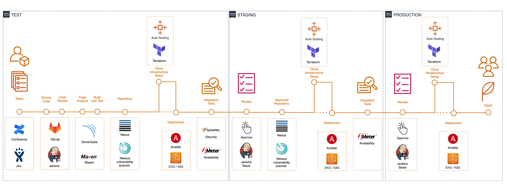

# DevOps CI/CD 流水线设计实践

在不同的环境中，最适合的 CI/CD 流水线会有所差异，尤其是在工具链层面，但大致的流程和思路应该是一致的。

<!--more-->

---

## 背景

在项目建设初期，架构师要求我们设计一个[DevOps CI/CD]^(持续集成，持续交付/部署)方案，提升生产效率。

通过参考一些业界的最佳实践，结合自身的特点，我们设计了一个较为通用，且能兼顾安全、审批和接管本地已有基础设施与服务的 DevOps CI/CD 流水线方案。最后成功落地实施，并在公司内的其它项目中进行了推广。

## 什么是 DevOps

### 1. 汽车工业

众所周知，大多数工厂都已经有了产品的自动化生产线。

特别是汽车行业，大约在一百年前，汽车是由人手工制造的，经过多次演变，从手工制造的高度定制的汽车，到手工组装的自动化零件生产，再到目前完全自动化的装配流水线，汽车工业已经具备了精益的自动化制造方案。

与汽车工业相比，我们的传统软件开发模式，已经落后了很多。

### 2. DevOps 是一种文化

什么是 DevOps?

有些人认为，DevOps 就是一堆软件和工具的集合，可以用来优化开发和部署。

DevOps 不仅仅是这些，它更是一种文化，它更多的是关于团队和组织，强调的是整个团队都应该参与到开发、测试和部署的自动化流程设计中，在出现问题时共同承担责任，协同处理。

### 3. DevOps 工具链与生命周期

DevOps 的生命周期从计划、构建、持续集成和部署开始，接着运维，然后反馈和再次计划。围绕在整个生命周期的各个部分，都有很多的应用和服务。

## 传统的开发模式有哪些缺点

### 1. 传统制造业的七种浪费

对于传统的制造业来说，非常容易在过度生产、运输、移动、过度加工、等待、库存和产品缺陷等方面浪费大量的时间和资源。因为这些过程大多数仍然需要手工作业，缺乏持续的自动化流程进行管理。

### 2. 传统软件开发模式的弊端

传统的软件开发模式有以下弊端：

+ 人工干预

  人工干预往往会导致难以重复的操作并引入人为错误，尤其是在测试和部署时。

+ 不一致的环境
  
  导致团队经常浪费几天甚至几周的时间来修复由环境不一致造成的问题，浪费了资源和时间。

+ 监测不足
  
  依赖于人工监测，很容易造成疏忽，导致部署出现问题，延迟产品的交付时间。

+ 缺乏共同承担责任
  
  团队成员缺乏共同承担责任的理念，导致在组织中存在各种沟通问题。

## 值得参考的 DevOps CI/CD 最佳实践

### 1. 轻量级且简单

由 GitLab + Docker + Ansible 组成的轻量级、简单的 CI/CD 流水线解决方案，来自一家快速成长的初创公司。其中，GitLab 作为源代码管理和持续集成工具，Docker 用于容器，Ansible 用于配置即代码。

### 2. All on Kubernetes

基于云服务和 Kubernetes 的 CI/CD 流水线，被称为“All on Kubernetes”，比较流行。

但由于“All on Kubernetes”需要确保所有的应用和服务都容器化，因此对比较复杂的环境和传统软件都不友好。

### 3. IBM DevOps 解决方案

IBM 的解决方案建议使用 DevOps 和云平台来帮助企业加速应用开发和交付的生命周期。

这个架构非常完善，包含了 DevOps 的各个方面。更多详情：https://www.ibm.com/cloud/architecture/architectures/devOpsArchitecture

### 4. 端到端的 CI/CD 流水线

端到端的 CI/CD 持续集成和部署交付流水线，包括了 IBM DevOps 解决方案中的大多数步骤，并且在每个步骤中，都推荐了相关服务和工具。

## 设计最适合的 DevOps CI/CD 流水线

### 1. DevSecOps

我们最关心的是安全，所以需要 DevSecOps，而不仅仅是 DevOps。

DevSecOps 并非一定要牺牲自动化流程，而是需要加入安全保障过程，在实施变化之前先进行审计。

### 2. 开发与测试环境

为了在测试环境中进行安全的开发和部署，以及上传和下载软件包，我们设计了四个网络区域，其中：

+ 在 A 区域中，可以连接到数据中心和共享服务，如 JIRA、GitLab 和 Nexus。
+ 在 B 区域中，可以创建服务器和部署服务。
+ 在 C 区域中，可以连接到一些受信任的官方仓库，如 Maven，在 Nexus 中集成安全扫描，如 Symantec 和 Nessus。
+ 在 W 区域中，可以在安全扫描和审计下进行开发。

通过这些方式，我们可以确保在测试环境中的所有软件包都经过了安全扫描。

### 3. 最适合的端到端 DevSecOps CI/CD 流水线

最终，我们确定了一个最适合自己的端到端 DevSecOps CI/CD 流水线。

它包括所有必要的步骤，跨越三个不同的环境，使用最流行的自动化工具和云服务，包括基础设施即代码和配置即代码，与安全工具集成，支持基于测试报告和安全报告的人工审批。

它包括以下内容：

+ 项目管理

  构思一个故事，在 Confluence 上记录，在 JIRA 上创建任务，将 GitLab 与 JIRA 集成。

+ 代码管理
  
  代码审查，将代码提交到 GitLab，然后由 GitLab 自动触发相关的 Jenkins 任务，进行代码分析，构建和单元测试，并打包上传到 Nexus 仓库。

+ 制品库
  
  通过 Nessus 自动扫描所有上传到 Nexus 中的软件包。

+ 基础设施即代码与配置即代码

  检查所需的基础设置是否已经就绪，如果没有，自动创建基础设施，然后将软件包通过配置即代码部署到服务器或 Kubernetes 集群。

+ 集成测试与安全测试

  对应用服务的可用性和安全性进行测试。

+ 审计和审批
  
  对整个流水线的各个过程进行安全审计，并在部署上线时进行人为审批，审批通过后自动到下一个环境中进行部署和测试。

最后设计的这个 DevSecOps CI/CD 流水线比较通用，能兼顾安全，审批和接管本地已有的基础设施与服务。

在此仅供参考，实际上在不同的环境中，最适合的 CI/CD 流水线会有所差异，尤其是在工具链层面，但大致的流程和思路应该是一致的。

