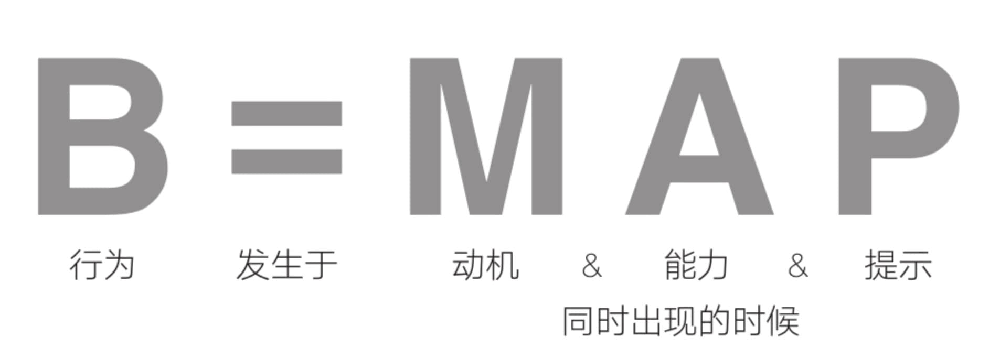

B=MAP，即「行为=动机+能力+提示」。把目标切分成多个细小的习惯，让看似不可能实现的目标变得容易。

<!--more-->

---

## 序

B.J.福格博士是斯坦福大学行为设计实验室创始人，行为设计学创始人，深入研究人类行为超过20年。

在这本书中，福格博士亲自拆解了他提出的福格行为模型，揭示了驱动人类所有行为的3个关键要素，即`行为=动机+能力+提示`，解析了每一个要素在驱动人类行为中的重要作用，提供了激发每一个要素以更好地推动行为改变的有效方法。

## 文摘

### 0. 前言

> 人为什么会抱怨，或者自我指责？因为没有达到自身期望，又无力改变现状。

> `B=MAP`，即「行为=动机+能力+提示」。

> 我非常欣赏的提议是“珍珠习惯”。  
> 
> 我们了解，珍珠的形成是因为蚌受到异物（砂粒、寄生虫）侵入的刺激，然后分泌珍珠质，一层一层地把刺激物包裹起来，即成珍珠。  
> 如果诗意地来说，每一颗美丽的珍珠，其实都是蚌包裹好的痛苦与刺激。人生在世，大大小小的烦恼和刺激，没人能躲开，关键就在于你会如何对待它们。  
> 
> 福格教授的“珍珠习惯”提议非常智慧。以他自己的一个小实践为例，福格教授睡眠不好，经常被半夜启动的空调吵醒。  
> 与其每次被吵醒后都烦躁地抱怨，不如设计出一个习惯——每次被吵醒后，就冥想放松。  
> 于是，他收获了一个明确的冥想放松时间段。最后，他甚至觉得被吵醒然后冥想、放松，还挺幸福。  
> 
> 对于那些确定会发生的刺激，建立一个习惯来“包裹”它，久而久之，也许你会得到一串生活的珍珠。

> 天下难事必作于易，天下大事必作于细。

> 习惯培养的6个步骤：激发动机、明确规范、榜样教育、持久训练、及时评估和环境育人。

> 简要概括一下福格博士的习惯养成方法，我们或许可以发现5大要点：  
> 
> - 第一、要自信，不要自责。  
>   那具体需要怎么做呢？一是停止自我批评；二是把你的愿望拆解成微行为；三是将每一次错误当成是一种新发现，并利用它们不断改进。  
> 
> - 第二、从小改变着手，​“简单”才能促进改变。  
> 
> - 第三、通过行为设计来养成好习惯。  
> 
> - 第四、在行为设计中要把握行为改变的三要素，即动机、能力和提示，而行为发生于三要素同时出现的时候。  
>   动机是做出行为的欲望，能力是去做某个行为的执行能力，而提示则是提醒你做出行为的信号。  
>   动机越强，就越有可能做出行为；行为越容易做到，就越有可能成为习惯；没有提示，任何行为都不会发生。  
>   因此，在改变行为的时候，需要检查确认三要素是否齐备。  
> 
> - 第五、及时庆祝是感受成功并将这种感受融入新习惯的最佳技巧，也是提升某种行为再次发生的概率的一种积极体验。  
>   而庆祝的原理就是，​“成功的动能”会让成功带来成功。  

> 我明白了“再大的困难也要从小事做起”这个道理，这就像是要读完一本很厚的书，翻开书只读一页，就已经朝着成功迈进了一步，值得庆祝。  
> 如果急躁地要求自己在某个时间段内读完，那也许没几个人能坚持下来。  
> 一路走来，我逐渐掌握了化繁为简的工作方法，十年如一日的坚持，最终迭代为促使我不断前进的能力，而且我在事业和家庭中都能运用自如。  

> 无论我们处于多么困难的处境中，都能通过构建一些小行为来让自己变得更好。

> 简单是我教给学生最重要的东西，简单才能改变行为。

> 并没有研究结果显示重复能够创造习惯，这两者不是因果关系，而是相关关系。

> 微习惯的精髓——让你通过感觉良好而不是感觉糟糕来实现改变。

> 行为设计的价值小即是大。即使是小事，也有可能带来巨大的改变。

> 如果你曾尝试过做出某种改变却未见成效，你可能就会认为是改变太困难，或是你自己缺乏动机而无法成功。  
> 这两种想法都不对。问题在于你所采用的方法本身，而不在于你。  

> 要想设计出成功的习惯并改变自身行为，你需要做到3件事：  
> 
> - 停止自我批评；  
> - 把你的愿望拆解成微行为；  
> - 将每一次错误当成是一种新发现，并利用它们不断改进。  
> 
> 这个过程不依赖意志力，也不需要你用奖励来激励自己，更不会要求你必须在多少天内做到哪些事。  
> 那些老方法都不符合习惯的运作方式，所以它们都不是促成改变的有效方法，而且它们往往会让我们感觉很糟糕。  

> 即使我本来就是一名行为科学家，我也必须去学习如何养成某种生活习惯。这并不是自然而然就能学会的，而是一个需要刻意练习的过程。  
> 通过练习，我将弱点变成了优势。  

> 如果你回想一下自己的经历，就会发现仅凭信息无法使你的生活发生改变。当然了，这不是你的错。

> 我发现能带来持久改变的只有3件事：经历顿悟、改变环境、从细微之处着手改变自身习惯。

> 创建积极习惯是起点，而创建微小的积极习惯则是培养更大习惯的途径。

> 从小改变着手的5个原因：  
> 
> - 原因1：可以利用碎片时间  
>   压力导致了一种匮乏心态——时间永远都不够用，没有多余的时间让我们用来培养新的积极习惯，于是我们拒绝改变。  
>   每天运动30分钟？每晚做一顿健康营养的晚餐？每天写心情日记？别想了。谁……有……这个……时间！  
> 
> - 原因2：可以立刻开始改变  
>   从小改变着手对你和你的生活来说都是最务实的。而且，这样能让你立刻开始。  
>   无论你是正身处人生中的绝望旋涡，还是除了压力过大之外，其他方面都算幸运，这个方法都能够适合你。  
>   
>   我用微习惯策略开启美好一天的简单配方：  
>   在我「醒来后双脚踩到地板上时」，我会「说出“今天又是没好的一天这句话”」。为了让大脑牢记这个习惯，我要立即：「微笑」。  
>   
>   如果你在进行毛伊习惯的训练时，觉得“今天不会是美好的一天”，我建议你仍然要把“今天又是美好的一天”这句话说出来。  
>   我发现这对提振心情非常有帮助，即使在我心情最糟糕的时候也是如此。  
>   请把毛伊习惯想象成每天早上3秒钟即可完成的简单练习。它能让你了解到开始改变是非常容易的，而且能帮助你学会行为改变最重要的技能——感受成功。  
> 
> - 原因3：不需要担心会失败  
> 
> - 原因4：一样能吃掉“大鲸鱼”  
>   吃掉“大鲸鱼”的最佳方法就是：  
>   一次咬一小口。抛开“要么做到最好，要么干脆不做”的想法，开始从小事做起。  
>   一个小举动或一次一小口，一开始可能显得微不足道，但却可以让你获得充足的动力去迎接更大的挑战，加速取得进展。没多久，你就已经“吃掉了整条鲸鱼”。  
> 
> - 原因5：不需要依赖动机或意志力也能做到  
>   如你所知，人们普遍认为行动需要依靠动机和意志力，总是在寻找可以增强并维持它们的方法。但问题是，动机和意志力天生善变，一点儿都不可靠。  

> 播下微习惯的种子：  
> 在使用微习惯策略时，无论多么小的成功，都可以庆祝一番。这样做能让我们充分利用大脑的神经化学反应，将有意识的动作快速转化为无意识的习惯。  
> 感受成功有助于固化新习惯，还能激励我们做更多事情。我每星期都会在微习惯研究数据中观察到这些成果。  
> 不仅如此，使用微习惯策略，你还可以学会如何在生活中获得更好的感觉。鼓励自己而非打击自己，拥有这种能力才能让改变的种子深深地扎根。  

> 她知道微习惯能改变一切，所以每天早上醒来，双脚踩在地板上后，她会立刻说出这句话：“今天又是美好的一天！”

> Anchor 锚点，Behavior 行为，Celebration 庆祝  
> 打开行为奥秘的钥匙，A B C 三步骤：  
> A. 锚点时刻提醒你去执行新的微行为的关键时点。例如，某个日常习惯（刷牙）或某件必然发生的事情（电话铃声响起）。  
> B. 新的微行为锚点出现后立刻去执行的微行为。这是新习惯的简化版，比如用牙线清洁一颗牙齿或做两个俯卧撑。  
> C. 即时庆祝完成新的微行为后要立刻庆祝。任何能带来积极情绪的事情都可以，比如说出“我很棒”之类的话。  

> 只要知道了如何调整人类行为的组成要素，就可以着手开始应对生活中的任何挑战。  
> 这意味着，你不会再有停滞不前的感觉，意味着你可以成为你想要成为的那种人。  

> 学习微习惯策略的最佳方式就是立刻开始行动。

> 全身心投入，边做边学。在做练习的过程中，不要过于紧张或焦虑，要会变通，并学会乐在其中！

> 提醒自己，成效最佳的改变源自感觉良好。  
> 如果让我从本书中挑选一个我希望你欣然接受的观念，那一定是：人们在感觉良好而不是感觉难过的状态下进行改变，效果最佳。  
> 
> 为此，我为你设计了这个练习。  
> 
> ❶ 将这句话写在一张小纸片上：“我在感觉良好的状态下进行改变，效果最佳。”  
> ❷ 将纸片贴在浴室的镜子上，或其他你经常能看见的地方。  
> ❸ 经常念这句话。  
> ❹ 留意这句话对你和你身边人的生活产生的影响。  

### 1. 福格行为模型，影响行为的要素只有3个

>   
> 
> 当动机（motivation）、能力（ability）和提示（prompt）同时出现的时候，行为就会发生。  
> 动机是做出行为的欲望，能力是去做某个行为的执行能力，而提示则是提醒你做出行为的信号。  

> 凯蒂是一个很有才干的高管，管理着数十名员工和1000万美元的预算，她的工作效率和她的好习惯息息相关。  
> 凯蒂每天下班前都会整理办公桌，这是她的固定习惯。结束当天工作并关闭电脑后，她会把文件摆放整齐，并把便利贴规整为“待办”、“已完成”和“处理中”3类。  
> 整理好办公桌，把椅子也推进去之后，凯蒂才会离开办公室。次日上班看到办公桌时，凯蒂都会有种精力充沛的感觉。  
> 这一切都在提醒她自己已经做好准备开启新的一天。我问她这个习惯是不是她有意培养的，她说不是，她只是在某一天突然就开始这样做了。  
> 
> 清理办公桌和狂刷手机，我们把凯蒂的这两个习惯结合起来分析一下。  
> 两种行为，让凯蒂产生了两种截然不同的感受。  
> 一种行为让凯蒂感觉良好，也让她如愿以偿，变得更加高效。整理这个行为已经变成一种自动自发的习惯，她根本无须多想就能做到。  
> 相比之下，刷手机的习惯虽然令她当时很尽兴，但事后却会让她感到自责。在床上刷手机让她很抓狂，但她还是控制不住自己。  

> 在动机很强时，人们无须依靠提示就能采取行动，还能做出更困难的行为。

> 行为越容易，就越有可能成为习惯。

> 既有动机又有能力，才能让行为落到行动线上方，而这两大要素可以像队友那样密切配合。

> 没有提示，任何行为都不会发生。  
> 如果没有得到提示，那么无论你的动机和能力有多么强烈都没用。要么得到行动的提示，要么得到不行动的提示。  

> 凯蒂刷手机的动机实在太过强烈，因此她也是在尝试过多种不同方式之后，才最终找到了一个双管齐下的办法：  
> 到了晚上就把手机放到厨房，在卧室里放一个老式闹钟。在她和手机之间增加的这段空间距离使得刷手机的行为更难实施，而放置老式闹钟则一并消除了手机的提示。  

> 理解行为，就能影响行为。

> 有没有一种冷静又有趣的方式可以让这个小男孩少踢我的座椅呢？  
> 
> 我决定使用互惠法则。别人送礼物给你时，你自然而然会想到要以某种方式予以回报。  
> 这种动力有助于人与人之间友好相处。这是我们可以优雅地影响他人动机的一种方式。我决定试一试。  
> 
> 我的电脑包里有一个黄色的笑脸按钮。我从包里掏出了按钮，拿给这名小乘客和他的父母看。  
> “嗨，”我说，“我想把这个笑脸按钮送给你。我希望它能帮助你记住在今天的飞行过程中不要踢我的座椅。”  
> 小孩说道：“好的！”他的父母则对我报以真诚的微笑。  
> 这次飞行很顺利，没有人再踢我的座椅，我还结交了几位朋友。各自领完行李后，我们挥手道别。  

> 我们真的不必自责。  

> 万事开头难，建立一整套积极习惯的第一步，是要先决定具体想培养哪些习惯。  
> 不过，在此之前，你得先分析清楚多年来一直困扰你的原因是什么。  
> 既然你正在看这本书，那就说明你很有可能有想改变却未能改变的事情。那么，是什么阻碍了你做出改变呢？  
> 
> 是动机猴子（Motivation Monkey）。动机猴子诓骗我们设下不合理的目标。  
> 有时候它确实也能帮助我们发挥出高水平，但在我们最需要它的时候，却往往不起作用。  

> 动机通常都不可靠。

> 在涉及自我提升类事务，比如节食、健身、创意项目、报税、创业、找工作、策划会议时，也是一样。动机猴子的陷阱到处都是，还都很隐蔽。

> 动机的确是行为的驱动要素之一，但问题在于，动机往往是易变的。

> 动机就像是一位酒肉朋友，你可以和它一起玩乐，却不能指望它会去机场接你。  
> 你必须了解动机的角色和限制，然后挑选出那些不太依赖这位善变的“朋友”的行为。  

### 2. 要素1，动机，找到实现愿望的黄金行为

> 明明拥有动机却还是无法改变的5个原因：  
> 
> 1. 动机很复杂  
>    动机是完成某个特定行为的欲望。  
>    
>    在我的研究中，我专注于3个动机来源：  
>    你自己（你想要的）；  
>    你希望通过采取行动可以得到的利益或受到的惩罚（胡萝卜加大棒）；  
>    以及你的周遭环境（例如，所有朋友都在做这件事）。  
>    
>    事实证明，人物（Person）、行动（Action）和情境（Context）是理解人类行为的基础。  
>    动机很复杂，有时候它们看起来就像是在进行一场心理拔河比赛。  
> 
> 2. 动机冲上顶峰后会迅速回落  
>    强烈的动机非常适合去做一次就能完成的真正困难的事情。  
>    然而，高水平动机是很难维持的。  
>    
>    在行为设计领域，我们将动机短期激增的现象称为动机波浪。  
>    你以前一定有过这样的经历：你的动机冲到顶峰，随后急转直下。  
>    或许你会责备自己没能坚持下来，但这不怪你，这就是动机在生活中的运作方式。  
>    
>    每年都有上亿人参加在线课程，但绝大多数人会半途而废。  
>    很多研究表明，最终结业人数只有不到10%。学生们一开始大都兴致勃勃、专心致志，但之后他们的动机就会慢慢减弱。  
>    即使学费不能退还，也不能让他们产生足够的动机来完成课程。这样的事情到处都有。  
>    
>    你陷入了人类思维的常见误区，你高估了未来的动机。即便是自控力极强的人也同样如此。  
>    你并不是愚蠢、轻浮或容易上当受骗，你只是一个普通人。  
> 
> 3. 动机波动十分频繁  
> 
> 4. 将动机用于追逐抽象概念无法产生结果  
>    想要实现愿望的欲望是持久的，它至少不会很快发生变化。  
>    愿望是改变人生的绝佳起点。  
>    拥有梦想和愿望都是好事，宣传健康意识也是好事。但把时间和精力用在激励自己或他人追逐不明确的概念上，则是错误的举动。  
> 
> 5. 仅凭动机无法实现长期改变  
>    在福格行为模型的3个要素中，动机是最不可预测和最不可靠的。  
>    
>    如果你以前只关注动机，那么现在，我希望你能够理解，想获得持久的改变，仅靠动机是不够的，因为你多半无法维持它，也可能无法对它进行可靠的操作或设计。  
>    你要明白，这不是一种性格缺陷，而是人的本性。不要掉进动机猴子的陷阱，你必须想方设法绕开它们。  

> 明确愿望与列出行为集群。

> 你应该有抱负、有梦想，或者有一个愿望清单。描述你想做的事情，越具体越好。只有知道自己想去哪里，才有可能真正地到达。  
> 人类天生就是梦想家，我们总是怀揣着几个宏伟计划，但也仅此而已，部分原因是善变的动机阻碍了行动的脚步。  
> 愿望是抽象的欲望，比如“想让孩子在学校取得成功”；而成果更容易衡量，比如“第二学期取得‘优’的成绩”。  
> 愿望和成果都可以作为行动的起点，但它们都不是行为。  
> 
> 有个简单的办法可以将行为与愿望和成果区分开来，行为是你现在或在某个特定时刻可以去做的事情。  
> 比如，关掉手机、吃一根胡萝卜、打开一本书读几页。这些是你随时都可以采取的行动。  
> 相比之下，你无法随时实现一个愿望或取得一个成果。比如，你无法突然改善睡眠质量，无法在今天的晚餐后就减掉几斤脂肪。  
> 只有坚持执行正确的具体行为，久而久之，你才能够实现愿望、取得成果。  

> 行为设计的第1步，就是明确愿望（或成果）。  
> 
> 你想做什么？你的梦想是什么？你想取得什么成果？把愿望或成果写下来，无论你写了什么，都有可能会需要修改。
> 
> 明确愿望有助于对真正想做的事进行有效的行为设计。  
> 也许你以为自己的愿望是“更加专注”，但如果你仔细思考，就会发现你真正的愿望是减轻生活压力，而这比“更加专注”容易得多。  
> 你可以每天散步、玩10分钟乐器，或是少看电视新闻。  
> 在这一步中，你要做的是修改你的愿望或想取得的成果，直到触及你真正想做的事情。  
> 不论是愿望还是预期成果，都可以作为行动的起点，不过我喜欢把愿望作为起点，因为它更灵活，而且没有具体的预期成果那么令人望而生畏。  

> 行为设计的第2步，是探索行为选项。  
> 
> 在这一步中，我们来具体探讨一些细节问题。  
> 选择一个愿望，然后列出一组有助于实现愿望的具体行为。不用做出任何决定或承诺，只探索你有哪些选择，列出的行为越多越好。  
> 
> 第2步的关键是探索，而且要非常乐观。  
> 为了找到尽可能多的行为选项，在挥舞魔法棒时，可以参考下面几种行为类型：  
> 你想做哪些一次就能完成的行为？  
> 你想养成哪些新习惯？  
> 你想终止哪些习惯？  
> 
> 每想出一个行为，都要提醒自己“很好，还有呢”，然后再继续探索。最后，你会得到一个行为集群，包含各种奇怪的、正常的、惊人的行为。这就对了。  
> 
> 如果你还没开始行动，那现在是时候了。在云朵上写下你选出的愿望。然后，想象你有一根魔法棒，它可以帮助你做出任何行为。  
> 把行为愿望改得非常具体（或者说是“简单明了”）之后，就可以进入下一步。  

> 行为设计的第3步，为自己匹配具体行为，并且要务实。  
> 
> 行为匹配的3个误区：  
> 
> - 误区1：全凭猜测，毫无章法  
> - 误区2：从网上找灵感  
> - 误区3：照搬朋友的成功经验  
> 
> 在行为设计领域，我们将那些与你最匹配的行为称为黄金行为(Golden Behavior)。  
> 黄金行为有3个标准：这个行为能让你实现愿望（影响）；你想做出这个行为（动机）；你可以做到这个行为（能力）。  
> 
> 黄金行为可以是单次动作，比如取消电视订阅服务，也许就能让你少看电视；  
> 黄金行为也可以是需要不断重复的习惯，比如在厨房而不是在床边给手机充电。  

> 你很难强迫自己去做不想做的事情，即使能强迫自己一两次，也不大可能养成习惯。  
> 如果我们为自己匹配的行为是我们本来就想做的，而不是我们认为自己应该做的，后面可能就没有必要过分强调动机方法或技巧了。  
> 我们把动机猴子踢出局了。  

> 行为设计强调了这样一个事实：持久改变的关键，在于为自己匹配真心想做的行为。

> 福格原则1：帮助人们做他们已经想做的事。  
> 通过行为设计匹配的新习惯，是我们在最忙碌、最没动力且状态最不好时，也能做到的行为。  
> 如果你觉得自己在最累的时候也能做到这个行为，那它可能和你非常匹配，甚至是一个黄金行为。  

> 轻松找到你的黄金行为：  
> 
> 这样做是正确的：只要新习惯没有达到预期效果，你可以随时修改。  
> 
> 大多数人将行为整理到焦点地图上后，都会找到黄金行为，并感到乐观、活力充沛。  
> 你想做的和能做到的行为最终将会集到一处，呈现出你最有可能去做的事情，这是培养习惯最肥沃的土壤。  
> 我在教授微习惯策略时，会让人们把新习惯想象成一颗颗小小的种子。只要把优质的种子种在合适的地方，无须细心呵护，它们也能开花结果。  
> 从你做得到且想要做的行为开始，就相当于种下了优质的种子。  
> 选择你能成功做到的行为，不仅能让你提升自信和掌控力，而且能增强你做出更大行为的动机。这一切都是从小事、坦诚和具体行为开始的。  

> 愿望可以是抽象的，但实现愿望的行为不行。  
> 行为必须实际、具体，它们是让你攀岩而上的支点和立足点。通往顶峰的路径是独属于你自己的，你要根据峭壁的实际情况来选择合适的行为。  
> 为自己匹配合适的行为是行为设计过程中最关键的步骤，也是探索问题时要重新检视的要点所在。  

> 首先，明确你的愿望或成果；  
> 其次，找到尽可能多的行为选项，并找出与自己相匹配的具体的黄金行为。  
> 这就是行为设计的具体过程，也是用微习惯策略找到最适合的习惯的方式。  

### 3. 要素2，能力，让行为简单到随时顺便都能做

> 行为设计的第4步，尽可能地简化事务。简化的程度很可能会让你觉得不可思议。  
>
> 人类的天性决定了我们无法长期坚持做令自己痛苦的事情，但如果从容易做的事情开始，就可以做到你想做的几乎任何事。  

> 很多人在改变时仍然抱有不做大事就干脆放弃的心态，因此，他们往往想不到如何从小事着手。

> 萨里卡从这些小事中获得了改变的能力和信心，固定进行小行为，不断由小及大。  
> 萨里卡终于过上了梦寐以求的规律生活，健康状况也因此大有改善。  
> 现在，她每天自己做饭、打扫厨房、坚持运动、冥想和浇花。萨里卡告诉我，她感受到一种前所未有的活力。  
> 萨里卡说，她最重要的收获不只是建立了健康的生活习惯，以及管理自己的病症的能力，还有这一切带来的自信心。  
> 现在她知道，只要从小事做起，一切改变皆有可能。  
> 
> 萨里卡不仅有了更高的行动力，而且感觉渐入佳境。  
> 动机高涨时，她爬上那习惯的小山丘，发现自己还想去追寻和尝试其他能让生活更加美好的事。  
> 她可以更轻松、更容易地完成一些事情。每当想培养新习惯时，萨里卡都会很兴奋并充满期待，那种不知所措的感觉很少再出现。  
> 这种心态的转变影响了萨里卡的一生。  
> 萨里卡和Instagram创始人之所以能克服改变的阻力、取得成功，是因为他们使用了一种相当可靠的方式：调整能力值，让事情变简单。  

> 这些新技能将帮助你达成长期的大目标。行为设计的力量，让你拥有了极大的改变潜力。无论你追求的是大改变还是小改变，从小事做起都是一个绝佳选择。

> “容易做”分析，在能力范围内找到行为。  
> 为了让你完成某个行为，动机和能力必须同时发挥作用并且充足，才能让你的行为位于福格行为模型行动线上方。  
> 我们已经证实，动机是不可靠的，但能力很可靠。  

> 简单改变行为。

> 你从一开始就应该先问自己这个问题：是什么让这个行为难以做到？  
> 根据我多年的研究和经验，答案可能涉及以下5个方面，我称之为能力因素：  
> 你是否有足够的时间？你是否有足够的资金？你是否有足够的体力？这个行为是否需要许多创意或脑力？这个行为符合你现在的日程吗？还是需要做出调整？  
> 这5个因素组成了一条能力链，能力链的强度等于其中最薄弱一环。  

> 从一个很难培养的大习惯开始，是不稳定的，就像一颗根浅枝大的植物，在生活风暴来袭时，很容易就会中断。  
> 然而，一个容易养成的小习惯却像韧性十足的幼苗一样，能够经受住狂风暴雨，因为它的根会扎得更深更牢。

> 实现“容易做”的3种方式：  
> 
> 1. 提升技能  
>    人们对于自己擅长的事情，总是能很容易做到。提升技能，就能增强能力。  
> 2. 获取工具和资源  
>    如果一种行为会让你感到沮丧，那它就很难成为习惯。  
>    更重要的是，每当她缺乏动机去做自己想做的事情时，她就会问自己：“我该怎样才能让这件事变得更容易？”  
> 3. 让行为变得微小  
>    让行为变得微小是微习惯策略的基石。  
>    这是因为，它是一种相当简单易行的方法，无论动机水平如何，微小的行为都是一个很好的开始。  

> 入门步骤，顾名思义，即朝理想行为迈出的最开始的一个小举动。  
> 
> 你可以这样告诉自己：我不必真的去健步走，我只需要确保每天穿上运动鞋就好了。  
> 
> 穿上运动鞋后，你可能就会改变想法——健步走这件事好像突然变得没那么难了。  
> 大多数时候，穿上运动鞋后，人们都会出门到附近走一走。这是入门步骤让小举动变成更大习惯的一种方式。  
> 不过，我要强调微习惯心态的一个关键点：不要过早地提高标准。不要急着做出更大的行为。  
> 如果你今天不想去健步走，那只穿一穿运动鞋也是可以的。把标准定低一些，有助于坚持下去。  
> 因为无论动机如何波动，你都可以确保自己始终有能力完成它。  

> “容易做”分析培养习惯“自己做早餐”。  
> 
> 发现问题：是什么让这个行为难以做到？  
> 问题在于：脑力是萨里卡能力链中的薄弱环节。她对要做什么早餐毫无头绪，柜台上堆满了盘子，所以她没地方再做其他事，这一切对她来说过于复杂，让她不知所措。  
> 
> 解决问题：怎样才能让这个行为变得更容易做到？  
> 解决方案：通过入门步骤方法，将烦琐的流程拆解成多个具体步骤，萨里卡让做早饭变得更容易了。打开燃气灶很容易做到，这个简单的行为带给她一种成功的感觉，促进了习惯的成长。  

> 现在我们来看看让行为变得微小的第二种方式：缩小规模。  
> 也就是说，你要将理想行为缩小到极小的规模，再开始行动。这可以说是理想行为的缩小版。  
> 让行为变得容易做到不仅有助于它生根发芽、茁壮成长，而且能够帮助你攻坚克难、坚守习惯。  
> 很多微小的植物，只要每天浇几滴水就能存活。对习惯来说，也是如此。  

> 只要足够简单，就能实现改变。

> 我们常有明知不能拖延却一直推迟的事情。  
> 关于拖延，请牢记一点：对困难的感知和实际的困难程度一样重要。  
> 一件事只要一天没有完成，就会让你多惦记一天，而且会让你感觉它越来越难。  

> 降低行动的门槛，可以让大脑活跃起来。

> 这个练习分为两部分：练习1侧重于分析，练习2侧重于设计。  
> 
> 练习1：对困难习惯进行分析  
> 
> ❶ 写下一个你过去尝试养成却没能坚持下来的困难习惯。如果你没有任何想法，那可以分析这个习惯：每天多吃蔬菜。  
> ❷ 问自己探索型问题：“是什么让这个行为难以做到？”围绕你能力链的薄弱环节进行思考，是因为养成习惯对时间要求太高，还是对资金要求太高了？是对体力或脑力要求太高，还是因为它扰乱了你的日程？  
> 
> 练习2：通过设计，让习惯容易培养  
> 
> ❸ 针对能力链上的薄弱环节，问自己突破型问题：“怎样才能让它变得更容易执行？”例如，或许可以考虑减少时间。但注意要确保针对每个薄弱环节都提出多个不同想法。  
> ❹ 从步骤3的想法中挑选出3个最可行的。  
> ❺ 想象自己按照这3个想法采取行动，试图让习惯变得更容易执行。注意探索具体操作方式的细节。  
> 
> 加分项：把解决方案付诸实践，看看实际效果如何。

### 4. 要素3，提示，善用锚点时刻让行为立刻发生

> 没有提示，行为就不会发生，提示就是在对你说：“现在就行动。”

> 提示是生活中的隐形驱动力。我们每天都会经历数百个提示，却极少留意到它们，而是直接采取行动。

> 行为设计的第5步：为你想做的行为设计出“对”的提示。这一点很重要。不要把提示交给运气。

> 行为设计的步骤：  
> 
> ❶ 明确愿望  
> ❷ 探索行为选项  
> ❸ 为自己匹配具体行为  
> ❹ 从微习惯开始  
> ❺ 找到“对”的提示  
> ❻ 庆祝成功  
> ❼ 排除障碍、重复和扩展  

> 在为自己设计提示时要注意，在已经贴满便利贴的电脑屏幕上再贴一张便利贴是没有用的；  
> 参加商务会议时，把提示写在手臂上的做法看起来也不够专业。  
> 无论如何，关于提示有效还是无效，我们还有很多要讲，否则，我们都会成为“习惯忍者”。

> 生活中常见的3类提示：
> 
> 1. 人物提示  
>    靠记忆来确保自己每天完成新行为，是不大可能带来持续的改变的。  
>    同样，想以这种方式帮助他人养成习惯也不靠谱。  
>    比如，你希望女儿每天晚上都能好好做作业，而不是玩一小时手机。要她自己记得这件事显然不是最佳策略，因为人物提示并不那么可靠。  
> 
> 2. 情境提示  
>    继续前往情境提示！周围环境中的任何事物都可以作为采取行动的提示：便利贴、App通知、电话铃声、提醒你参加会议的同事。  
>    如果当时我为聚会设置了一个日历提醒，丹尼和我应该就能带着新鲜沙拉准时出现在邻居家。  
>    如果设置的情境提示太多，可能还会产生反效果——令人变得迟钝，无法注意到提示，比如听不到提示铃，或对便利贴视而不见。  
>    这就像是住在火车轨道附近，一开始觉得火车发出的声响难以忍受，后来……哪里有火车？  
>    
>    我的书房里有一个大白板，上面罗列着许多待办项目，不同项目有不同的颜色标记。  
>    为了管理它带来的视觉和心理上的压力，我用一块布遮住了那些当前不用做的事情，只露出需要当天完成的事情的提示。  
>    我发现遮住其他事情的提示能让我更冷静、更专注。  
>    如果你设置的情境提示没有效果，可能并不是因为你做错了什么，或者缺少动机或意志力。  
>    请不要责怪自己。你只需重新设计提示，找出对你有用的提示。  
> 
> 3. 行动提示  
>    相比于人物提示和情境提示，行动提示的效果是最好的，我还给它取了另一个名字：锚点。  
>    打开内衣抽屉时，我发觉自己每天要做的事情有很多。如果能把新行为与既有习惯结合起来，就能毫不费力地将它们融入生活。  
>    只要一直将新习惯锚定在既有习惯上，就能毫不费力地不断插入新习惯。  
>    这种方法避开了人物提示和情境提示的缺点，因为你不用再依赖自己或他人来提醒你，也不会有过多提示干扰你。  
>    生活中的每一个行为都是提示。这再简单不过了。  
>    
>    利用锚点来设计提示是一种很棒的方式，因为任何人都可以做到，不需要手表或时髦的App就能提示你去完成新习惯。  
>    你自己就能有效地进行，你会发现简单设计技巧能带来多大的转变。“之后”的力量不是魔法，更像是化学反应。  
>    为对的行为安排对的顺序，于是转眼间，一个新习惯水到渠成。  

> 设计“对”的提示的3个步骤：  
> 
> - 步骤1，确定你的锚点  
>   锚点必须是生活中一定会发生的事情。  
>   有些人的生活非常规律，充满了可靠的日程；有些人的生活比较随性，不过，无论多么随性，都会存在许多持续的日程，而这足以当作锚点。  
>   早在创建微习惯策略之前那几年，我就在一项研究中发现，人们往往都是早晨时段的日程安排最多。因此，早晨是培养新习惯的最佳时间。  
>   
>   匹配物理位置：  
>   首先，要考虑新习惯发生的地点，找出已经存在于那个地点的锚点行为。  
>   如果你想培养的新习惯是擦拭厨房桌面，那就到厨房里寻找可以当作锚点的既有日程。要注意避免锚点和新习惯在不同地点发生的情况。  
>   我的研究表明，地点不同，极难奏效。在匹配锚点和新习惯时，地点是最需要考虑的因素。  
>   
>   匹配频率：  
>   其次，检视既有日程时，要考虑多久进行一次新习惯。  
>   如果你想每天进行一次，就把它安排在一天一次的锚点行为之后；如果你想每天进行4次，那就把它安排在一天4次的锚点行为之后。  
>   
>   匹配主题/目的：  
>   最后，你可以选择与新习惯拥有相同主题或目的的锚点行为。  
>   如果你喝咖啡是为了提升工作效率，那它很适合用来作为你打开待办事项App的锚点行为。  
>   设计新习惯配方时，不要追求完美。因为如果你不喜欢这个配方，那你随时可以调整它。  
> 
> - 步骤2，用试验将锚点与黄金行为联系起来  
> 
> - 步骤3，利用“最后动作”优化锚点  
>   “在我吃过早饭之后”就是一个模糊的锚点，它的最后动作是“在我打开洗碗机之后”，把关注点放在这里，效果会更好。  
>   “在我下班回家之后”也是一个模糊的锚点，你可以把它改成“在我把包放下之后”，这样的描述更加具体。  

> 千万别低估了“顺便习惯”的威力。持续的微行为能创造出巨大的改变。

> “珍珠习惯”，管理压力与焦虑：  
> 
> 一旦学会设计和重新设计生活中的提示，就能以一种全新的方式来管理人生中的压力与焦虑。  
> 我将这些习惯称为“珍珠习惯”（Pearl Habit），因为它们的本质是将原本惹人厌烦的事情，转化成美好的提示。  

> 埃米巧妙地利用提示做到了这一点。用他人的行为来提示自己做出正向而非自我挫败的行为，在感到无助时不失为一个好主意。  
> 而且，埃米从中得到的积极影响远超她的初衷。  

> 微习惯如此美妙是因为它能引发连锁反应，而其中的奥秘就是：成效最佳的改变，源自感觉良好，而非感觉糟糕。  
> 
> 埃米精心地用提示来设计改变，使自己立于不败之地。那些改变之所以奏效，是因为它们帮助埃米做到了她已经想做的事情。  
> 那成功之后呢？感觉如此美妙，让她想一直追寻。而且，她越来越有自信，只要自己精心设计，就能拥有更多美好。  
> 埃米越来越能让行为变得容易做，而且越来越喜欢设计提示，这让开始一个新习惯变得轻而易举。  
> 轻松的过程进而增强了改变的动机，这也让她更愿意去尝试新的看似更困难的事情了。  
> 埃米能如此成功还有另一个原因，那就是她迈出了能引起涟漪的最后一步：庆祝。她会用微习惯策略的技巧，立即创造积极情绪。  

### 5. 创造积极情绪，将行为固化为习惯

> 庆祝是习惯养成的“肥料”。每一次庆祝都会让相应的习惯牢牢地扎根，而坚持庆祝的累积效果会滋养整座“习惯花园”。

> 我在研究中发现，成年人有很多种跟自己说“我做得不好”的方式，却很少掌握对自己说“我做得不错”的方式。  
> 我们极少认可自己的成功，也很少对自己取得的成就感觉良好。  

> 感觉良好是微习惯策略的重要组成部分。你可以通过我称之为“庆祝”的技巧来创造这种良好感受。  
> 采取微习惯策略来进行庆祝，你就可以根据需要创造出一种内在的积极感受。  

> 我对着镜子里的自己笑了笑，说出一个词：胜利！然后我就发现，我的感受发生了一些变化，我内心曾经漆黑一片的地方仿佛照进了一道光。  
> 我感觉自己没那么焦虑了，而且有点激动。  

> 不管发生了什么，我都能在每一天创造让自己感受良好的片刻时光，而这实在太珍贵了。

> 令她惊喜的是，她最终发掘了自己的潜力，她因此而感到自信。开始实践微习惯策略后，她逐渐意识到自己过去一直在妄自菲薄。

> 在日常生活中，我也观察到，包括世界级运动员在内的一些人，都会很自然地庆祝自己取得的成绩。

> 当我们有效地进行庆祝时，大脑里的奖励通路会被激活。通过在恰当的时刻为自己创造良好的感觉，你能促使大脑识别并铭记刚才所执行的一系列行为。  
> 换句话说，你可以依靠庆祝和自我强化来“搞定”大脑，从而养成习惯。  

> 行为设计，本质就是情绪设计。

> 当一个宝宝学会走路时，父母会为他们鼓掌庆祝，这是全世界父母都会做出的自然反应，这种行为只有一个目的：在正确的时机进行庆祝能够帮助孩子们更高效地学习。

> 一系列的积极体验可以强化新行为，让人形成习惯性的反应。

> 良好感受刺激大脑产生名为多巴胺的神经递质，即“大脑中的化学信使”，它控制着大脑的“奖励系统”，帮助我们记住那些可以产生良好感受的行为，这样我们就会继续去执行那些行为。  
> 在多巴胺的帮助下，大脑会对因果关系编码，进而产生对未来的期望。  

> 习惯来自让你感觉美好的情绪。

> 一个人做出某种行为时的感受和他未来再重复该行为的概率，两者之间存在直接关联。

> 长期以来，人们一直相信“重复创造习惯”的古老智慧，执着于养成习惯所需要的行为重复天数。  
> 当今一些博主仍然将重复的程度或频率视为养成习惯的关键所在。他们这样只是在重复旧思想，尚未做出开创性的研究。  

> 我研究发现，只要人们能对一种行为产生强烈的积极情绪，通常用不了几天就能形成习惯。  
> 事实上，有些习惯几乎是立即形成的，有些行为只需完成一次，你就不会再考虑其他选择，养成即刻习惯。  

> 不管是为自己还是为别人设计培养习惯的形式，其本质就是在设计情绪。

> 融入习惯的正向强化方法有很多种，但我在研究和教学过程中发现，创造成功感觉是最有效的方法之一。

> 用庆祝滋养你的“习惯花园”。  
> 庆祝是创造积极感受并将其融入新习惯的最佳技巧，不用花钱，效果却立竿见影，并且适用于所有人。  

> 行为科学对奖励的定义是提升某种行为再次发生的概率的一种体验。奖励的时机非常关键。  
> 几十年前科学家们就已经了解到，奖励的时机要么是在行为过程中，要么是在行为结束之后的那一刻。  
> 获得奖励时，大脑会非常迅速地释放和处理多巴胺。这意味着你必须抓紧时间衔接这种好的行为和感受，以推动习惯的养成。  

> 庆祝的原则，“及时又简单”。

> 福格原则1：帮助人们做他们已经想做的事。

> 福格原则2：帮助人们感受成功。

> 如果某款产品让你感觉自己很笨，很有挫败感，那你很难喜欢上它。但如果某款产品让你有了成就感，那你就会喜欢它，想要多多使用它，甚至离不开它。

> 这是一套“组合拳”：你得在行为之后立刻庆祝（即时性），同时需要真切感受到庆祝带来的积极情绪（强度）。

> 你不必一定要用伴随大幅度肢体动作的方式来庆祝。简单地微笑或是在心中默默地肯定自己，也有效果。

> 大脑可不想感到尴尬，它想要的是真正良好的感觉。庆祝是很私人的行为。  
> 能让我感觉良好又不觉得傻的庆祝方式，跟能让你感觉良好又不觉得傻的庆祝方式，很可能是不同的。  

> 然而，如果你的个性是喜欢自我批判或是有些悲观导向，庆祝可能就没那么自然了。

> 成功的感受：发光(Shine)。

> 你早已体会过这种感觉：  
> 如果考试得了高分，你会感到自己在发光；  
> 如果你的演讲非常棒，在结束时人们纷纷鼓掌致意，你会感到自己在发光；  
> 如果你第一次做的菜肴闻起来非常美味，你会感到自己在发光。  
> 
> 我相信庆祝这项技巧对培养习惯来说会有突破性的作用。  
> 原因就在于，通过巧妙地庆祝，我们可以创造出一种自己在发光的感觉，进而促使大脑对新习惯进行编码。

> 以下是一些庆祝方式，包括当你身处人群之中时可以采取的庆祝方式和适合在家中独自完成的庆祝方式：  
> 
> 说“太棒了”或“耶”。  
> 挥舞拳头。  
> 大笑。  
> 想象孩子们在为你鼓掌。  
> 哼一首你喜欢的乐观向上的歌曲。  
> 跳跳舞。  
> 拍拍手。  
> 点点头。  
> 给自己点赞。  
> 想象一群人在欢呼庆祝。  
> 在心里对自己说：干得不错！  
> 深呼吸。  
> 打响指。  
> 想象看见烟花在绽放。  
> 向上看，做出“V”的手势。  
> 得意地笑，告诉自己：“我得偿所愿了！”  

> 有一天，做完深蹲后，吉尔决定要跟女儿击个掌。那种感觉真好，她后面几天都这么做了。  
> 一个有女儿陪伴的特别的庆祝动作就这样诞生了。  

> 你固然可以抗拒学习庆祝这项技巧，但要知道那样你就放弃了养成习惯的最佳方法。  
> 对大多数人来说，相比于养成习惯要付出的代价，学会为自己庆祝要付出的努力压根就不值一提。  

> 我跟所有学生都说过，能够完全按照计划去执行新习惯是个不小的成就。  
> 我认为，无论改变的程度或速度如何，能做出改变本身就是一件相当了不起的事情。难道这不值得庆祝吗？  
> 
> 如果你觉得为芝麻大小的事庆祝很难，那多半是一种“要么做到最好，要么干脆不做”的思维在作怪。  
> 别听它的，那是个陷阱。无论你取得了多么微小的成功，为这个成功而庆祝都能很快带来更多成功。  
> 回想一下那些你本可以改变却没有改变的事吧。做两个深蹲，你正在改变，这就足够了。  

> 庆祝小事，迅速感受到成功。

> 在这个追求功成名就、强调说到做到的时代，我反而希望你降低对成功的期望。  
> 这不是因为我不希望你取得卓越成就，而是因为你需要从小处着手，方能成就大事。  

> 固定习惯需要反复演练。  
> 为了快速固定习惯或帮助自己记住要执行习惯，你需要反复演练行为序列（锚点结合新习惯），然后立刻庆祝，之后重复7～10次。  

> 演练微习惯，既是在训练肌肉记忆，也是在给大脑重新连线让它记住。只要找到一个有效的庆祝方式，你就能迅速地钻研和固化习惯。  
> 庆祝让习惯保持活力。  

> 打一场“庆祝闪电战”。

> 在生活中的任何时刻都可以庆祝。  
> 不需要计划，也不需要写下微习惯配方。留意你做出的良好行为，然后为它庆祝就行了。  
> 如果你能够感觉到发光，那你就可以让这种好的行为变成自主自发的习惯。  
> 更重要的是，想方设法地去感受积极的情绪，让积极的情绪成为你改善生活的动力。  
> 记住，改变的最好方法是感受积极的情绪，而不是感受消极的情绪。  

> 终有一天，庆祝会与正念和感恩一样，成为提升幸福感的日常行为。

> 如果你只能从这本书里学到一样东西的话，我希望是：为你的微小成功而庆祝。  
> 即使你觉得自己一时之间还无法摆脱困境，生活中的小小改变也能够产生巨大的影响力。  
> 庆祝可以成为你的救生绳。  

> 感受成功不仅仅是我们用来固化习惯的一种技巧而已，它也是那种“要么做到最好，要么干脆不做”思维的解药，让我们转换视角，用全新的视角来看待自己。

> “庆祝闪电战”是一根救生绳，需要的时候她可以扔给自己以便把自己拖出水面。

> 这就是庆祝的力量，可以改变人生、改变世界的力量。它会非常微妙且有效地改变你的人生。  
> 现在的你，不管想要成为什么样的人，都能成功。  

### 6. 高频率小成功，让小改变自然生长

> 从你想要改变的地方开始，逐渐让自己感受到成功。接着你只需要相信这个过程，期待改变发生。

> 他发起“大肚腩之战”不是为了好看，更多的是为了健康。  
> 不幸的是，苏库马尔陷入了我们熟知的一种循环，速效减肥的饮食计划与雄心勃勃的锻炼计划反复交替。  
> 习惯需要多久才能够长大到完全形成？这个问题没有统一的答案。  
> 任何你听到的关于习惯需要21天或60天才能完全成形的说法，都是不完全准确的。并没有这么一个关于时间的魔法数字。  

> 从想改变的地方开始，逐渐感受成功。  
> 成功会带来成功，你一定早就听过这种说法了，而我的研究再次证实这是真的。  
> 但我还有一些发现可能会让你感到惊讶，那就是成功的大小似乎并不那么重要。  
> 当你因为某事而感受到成功时，即便是非常微小的成功，你的自信心也会迅速增强，再次执行习惯、做出相关行为的动机也随之增强。我称之为“成功的动能”。  
> 更令人惊讶的是，造就这种动能的是你获得成功的频率，而不是成功的大小。  
> 因此，借助微习惯，你可以迅速地取得一连串的微成功，而非那种耗时长久的大成功。  

> 希望和恐惧是相互排斥的两个动机向量，两者之和就是你的整体动机水平。如果你能够移除恐惧向量，那么希望将占据主导地位，而你的整体动机水平就会更高，这或许就能带动你超越行动线，做出行为。

> 掌握技巧，变身“习惯忍者”。

> 保持灵活性。如果你想创建一个理想的习惯清单，记住不要太拘泥于这个清单。你的喜好和需求是会变化的。  
> 或许今天你把每天练习倒立纳入了清单，但6星期后你或许又不关注这件事了。在前进的过程中要保持灵活性，并为学习新事物留出空间。  

> 自我洞察。

> 以下是可用于预测新习惯对你是否有意义的一些指南：
> 
> - 新习惯能够助力你成为你想成为的人。
> - 新习惯可以帮助你实现某个重要的愿望。
> - 新习惯虽然微小却能产生极大影响。萨里卡每天打开燃气灶的习惯很小，但却触发了一系列变化。

> 关键在于要找到你可以做出的最小、最容易但意义却最大的改变。  
> 
> 她意识到这个小小的动作却关联着她更大的愿望，即创造更和谐的家庭生活和更亲密的夫妻关系。  
> 一旦建立了这种重要关联，她就能产生足以为习惯供给能量的意义感了。她利用这项技巧找到了对她有意义的习惯。  
> 一旦找到了跟吃蔬菜相关的深层愿望，你就能够更顺利地养成吃蔬菜的习惯。  
> 
> 你可能找到很多隐藏的意义：  
> 或许你已经到了一定年纪，想要保持身体健康，能够看着子辈孙辈长大成人；  
> 或许你只是想在出席公司年度会议时穿着得体、充满自信。  
> 这些愿景中的任何一个都足以激励你下定决心多吃蔬菜。  

> 在持续执行一个新习惯的过程中，你自然而然就会追求更多或难度更高的新习惯。  
> 那时候，你会找到舒适区的边界，并体会到略微打破边界的感觉。  
> 清楚自己的舒适区边界在哪里可以帮助你养成更复杂或难度更大的习惯，而不会因为感到力不从心的痛苦或沮丧而削弱习惯。

> 行为设计的步骤：  
> ❶ 明确愿望  
> ❷ 探索行为选项  
> ❸ 为自己匹配具体行为  
> ❹ 从微习惯开始  
> ❺ 找到“对”的提示  
> ❻ 庆祝成功  
> ❼ 排除障碍、重复和扩展  

> 关于如何调整习惯难度的操作指南：  
> 
> - 不要给自己施加太多压力去试图养成更高阶的习惯。  
>   如果你生病了、累了，哪怕只是心情不好，那就将行为规模缩小到最微小的程度。  
>   如果你想多做一些，也随时都可以提高标准，但只要有需要，你也可以随时降低标准到最低程度。  
>   灵活性是这项技巧中的一部分。  
> 
> - 如果你想多做一些，不要限制自己。让动机来告诉你该做多少和该怎么做。
> 
> - 如果你做了很多，一定要为自己额外付出的努力而庆祝。  
>   如果为了提升习惯而给自己太多压力，你就有可能觉得痛苦或沮丧，这反而会削弱习惯。  
>   如果出现了这种情况，你可以通过加倍为自己庆祝来抵消负面情绪。  
> 
> - 利用情感标志来帮助你找到边界。  
>   沮丧、痛苦以及逃避等情绪标志着你的习惯出了问题，可能是难度提升太多、太快。  
>   但如果你是对现有习惯感到有些厌倦，那么你或许还需要再提高些难度才行。  
> 
> - 现在我希望你专注于改善周遭的环境使之更利于习惯养成，而不是想着靠降低习惯的难度和规模来让习惯易于执行。

> 养成在前一天晚上洗好黄瓜并且切片的习惯（持续的习惯）；  
> 告诉家人不要动你的黄瓜（单次动作）；  
> 确保冰箱够整洁，方便你能够立即找到黄瓜（每星期一次的习惯）。  

> 通过重新设计情境来养成习惯，可以减少摩擦，让习惯行为可以轻易地超越行动线。  
> 那些提前清洗过并切成片的黄瓜会让你的新习惯畅通无阻。  

> 当她注意到凌乱的台面阻碍了她做早餐的热情时，她找出了习惯养成的环境缺陷，并通过养成“在前一天晚上做好清理”的新习惯对之进行处理。

> 你会越来越擅长重新设计情境以养成良好习惯。  
> 一旦开始以这种方式来看待世界，你就会发现这些微不足道的障碍是如何阻碍你获得良好习惯的。  
> 通过精心设计情境来达到对新习惯悉心照料的结果，能够让你的整个生活都更轻松。  

> 关于重新设计情境的一些指南：  
> 
> - 在设计新习惯时，也投入时间重新设计情境以便让习惯易于执行。
> - 开始执行新习惯时，边执行边调整情境，并根据需要重新设计情境以便让习惯易于执行。
> - 大胆质疑传统。
> - 购买你所需要的装备。

> 此时，你应该已经学到了一些有价值的心态调整技巧：  
> 
> - 以开放、灵活和好奇的态度来应对变化。
> - 能够降低期望。
> - 通过为成功（不管是多小的成功）庆祝获得良好的感觉。
> - 对改变过程保持耐心和信心。

> 人们在刚开始实践微习惯时，我经常会听到他们说“我已经习惯了这样子”、“我不是那种很容易改变的人”或者是“这些对我来说都不管用”。  
> 但同样是这些人，有很多人就在短短5天的计划之后就改变了腔调，告诉我说“这真是难以置信，我必须承认我错了。  
> 我是可以改变的人”，或者“我就知道我是那种可以坚持到底的人”。  

> 由于总是会听到人们说出“我就是那种……的人”这个句式，我决定将其纳入微习惯策略的评估流程，在为期5天的计划结束时，我要求人们补全下面这句话：“在实践微习惯之后，我现在认为自己是那种……的人。”

> 在收集了这些数据之后我发现，随着人们在养成习惯方面变得越来越熟练，他们的自我认知也在改变。  
> 在开始微习惯计划时，他们认定自己是某种类型的人，而在5天的微习惯计划结束的时候，他们则已经开始拥抱一种新身份了。  
> 很多新身份会让人愿意相信自己的改变潜力，也有其他身份的变化方向是与习惯类型以及人们已经做出的改变有关的。  

> 作为社会人，我们在很大程度上都是在遵循某种特定身份采取行动的，虽然或许我们自己都没有意识到这一点。

> 身份转变会推动改变加速，因为它能帮助我们培养出一系列的行为习惯，而不只是一两个单独的行为习惯。

> 他同样还习惯了认为自己是个不会穿衣服的人，但后来他意识到，由于他的肚腩已经消失了，购物现在已经变成了一种令人愉快甚至兴奋的体验。  
> 看着镜子里的自己，他感觉状态很好。  
> 苏库马尔开始质疑心中曾经很牢固的消极自我认知，那是带给他痛苦和失望的身份认知。  
> 既然他可以做出原本以为不可能的改变，他断定自己可以改变他想要改变的一切。  
> 
> 对苏库马尔来说，这种赋能和乐观的感觉为他带来了真正的转变。  
> 他在生活中的各个方面都变得更为自信，他离开已工作19年之久的公司，创办了自己的公司，以微习惯为重点帮助大型组织展开变革。  

> 接下来，让我们深入细致地学习如何构建这些重要的身份认知技巧：  
> 
> - 用你想要拥抱的一种身份或多种身份，补全“我现在认为自己是那种……的人”这句话。  
> 
> - 参加那些汇集了跟你的新身份相关的人员、产品和服务的活动。  
>   当我决定要吃发酵食品时，就去参加了当地的发酵节。  
>   我遇到了比我更有经验的爱好者，知道了很多新产品，参加了一个有专家讲授如何制作泡菜的工作坊，还购买了制作发酵食品所需的设备。  
>   我带着更强的身份认同感回到了家，认定自己就是会吃甚至会制作发酵食品的那种人。  
> 
> - 学习行话，了解谁是专家。观看跟你感兴趣的变化领域相关的视频。  
> 
> - 穿T恤也是用来表明身份的一种常用方式。  
>   耐克牌T恤代表了跑步爱好者，而我穿的T恤上面印有冲浪板或冲浪场面的图像。  
>   我每年冲浪过百次，我可不会觉得自己是在装腔作势，将这种身份穿在身上感觉很自然。  
> 
> - 更新你的社交媒体页面，换一张能够展现你新身份的档案照片，再看看人们的反应如何。  
>   修改网上的个人简介，加一些跟你的新身份相关的内容。  
> 
> - 教导他人或成为榜样都能够强化你对新身份的认知。社会地位的力量是很强大的。  

### 7. 行为改变系统方案，一次只解一个结

> 行为设计追求的并非某个独立的结果。行为设计的每一个习惯、每一项改变，都是可以在池塘里引起涟漪的一滴水。

> 我建议不要用“打破”，而是用一个别的词和一个隐喻：想象一条缠在一起、打满了结的绳子，压力过大、看屏幕时间过长和拖延等习惯就是这条绳子上的结。  
> 你无法一次解开所有结，并且从长远来看，紧拉绳子可能会让情况变得更糟。你必须逐一解开这些结，而且不需要一开始就专攻最难的部分。  
> 为什么呢？因为最难解的结是隐藏最深的，你必须有所规划，先找出最容易解开的结，从它开始。  

> 无法改掉坏习惯会引起人们深深的羞愧感和内疚感，为什么呢？因为许多文化都很重视个人责任感，认为如果你无法做到“对”的事情，那必然是性格方面存在缺陷。  
> 在行为改变领域，这是一种过于片面且毫无益处的观念，但它已然在人们心中根深蒂固。  

> 不过，请你首先要记得：如果你曾听从误导性建议来打破习惯，结果却没有成功，那么这不是你的错。  
> 你只是被灌输了有缺陷的思维和做法，因而陷入挫败和举足不前的循环。  
> 其次要记得：你可以用一种更聪明、更有效的方式来设计出你想要的改变。  

> 坏习惯和好习惯的基本要素并没有本质性不同，行为就是行为，它始终是动机、能力和提示这3大要素同时作用的结果。

> 当你做出一系列积极的改变时，就会更加接近你想成为的自己。  
> 如果在这些改变中你感受到了成功，那你自然会重新看待自己，并开始接受自己的新身份。  
> 新身份会带来更多积极习惯，但它还有另一个作用：挤走那些你不想要的行为。它们已经不符合你的新身份和焕然一新的你。  

> 人们往往倾向于选择先解决最困难、最棘手的习惯问题，但这种做法是错误的，这就像是一开始就要去解一团乱麻中隐藏最深、系得最紧的那个结。  
> 正确的做法是，从最容易改掉的具体习惯开始。  

> 你也可以直接删除社交媒体App。这是一种单次行为，通常会比每天关闭通知功能这种日常动作更有效，因为它只需要完成一次，不需要养成习惯。

> 具体的做法是，想办法让自己不想要的习惯和你重视的某个习惯日程发生冲突，而你重视的日程比你想要改掉的习惯更重要。

> 如何用其他行为削弱习惯的动机：  
> 早点睡觉，以削弱自己早晨赖床的动机；  
> 参加聚会前先吃点儿健康食品，可以降低你在聚会上狂吃不健康食品的动机；  
> 每星期做一次针灸，可以降低你吃止痛药的动机。  

> 在冰箱上贴了一张纸，上面写着：“停！你已经超重了！”这固然能降低你吃东西的动机，但也会影响你的斗志。  
> 成效最佳的改变，源自感觉良好，而非感觉糟糕。因此，要确保你的去激励因素不会演变成自责之旅。  

> 在大多数情况下，以惩罚或威胁自己的方式去终止习惯都是不好的，因为相对于那一星半点的收获而去承担这种风险是不值得的，尤其是在你还有其他选择的时候。

> 重要的是找到替代坏习惯的新习惯。

> 从小改变中看到颠覆的美。

> 当你成功摆脱那些坏习惯时，你也会感受到同样的乐趣。这已经很棒了，但更令人振奋的是你在生活中创造出新空间之后突然出现的那些事物。  
> 摆脱坏习惯之后省下来的时间，可以用来做你喜欢的事，也可以用来提升工作效率，还可以用来加深人际关系，或是拓展一个新身份。  

> 设计新习惯，给周围的人带来更和谐健康、更有意义的生活。

> 改变群体行为方面，主要有3种方法：  
> 
> - 设计改变自身行为，从而让自己远离群体的负面影响；
> - 与其他人一起设计改变你们的集体行为；
> - 为他人设计一个对他们有利的改变。

> 通过微习惯策略和行为设计，你可以成为他人生活中的正能量。一个具备相应技巧并充满爱心的人（就是你），足以促成一个群体的改变。

> 当你使用行为设计和微习惯策略时，你可以相信，自己就是在帮助他人取得成功。  
> 在帮助他人完成改变的过程时，福格原则可以成为你的向导：福格原则1，帮助人们做他们已经想做的事；福格原则2，帮助人们感受成功。  

> 如果你正在帮助伴侣、同事、老板、客户或孩子完成他们想做的事情，那你很可能已经站在了坚实的道德基础上。  
> 帮助他人感受成功从来都不是一件坏事。如果你对你试图帮助他人实现的改变感觉良好，那么你就已经做好准备了。  

> 群体行为的设计流程：  
> 
> 1. 共同明确愿望
> 2. 共同探索行为选项
> 3. 为群体匹配黄金行为  
>    让团队作为一个整体来使用这个方法。作为一个家庭或一个工作团队开展协作会让你们受益匪浅。  
>    一旦在绘制焦点地图过程中达成共识，集体就做好了准备，共同将黄金行为付诸实践，并彼此支持。  
> 4. 让黄金行为变得对每个人来说都“容易做”
> 5. 找到黄金行为的提示方式
> 6. 庆祝成功以巩固习惯  
>    “人们在感觉良好而非感觉糟糕的状态下才能获得成效最佳的改变”后，你就可以将它用于改变自己的生活了，你同样也可以将它用于帮助身边人做出改变，无论是你的员工、孩子、伴侣还是患者，都可以。  
>    在练习冥想的时候，不是非得静下心来才算得上成功，能够安静地坐着就是一种成功，他们应该为此而感觉良好。  
> 7. 共同排除障碍和重复

行为设计能够应对任何挑战。

### 8. 结语：改变一切的小改变

> 创造一种积极改变的家庭传统。不管这看似多么具有挑战性，请从现在开始行动吧。  
> 通过分享微习惯策略及“发光”概念，你们可以从今天开始，在改变的过程中相互支持。  
> 当你们一起学习和演练改变技巧时，你们将创造出一份持续的激励自主的传承。  

> 拥抱成功的感觉，并为日常生活增添更多美好，会让世界变得更加光明，这不仅仅是为了你自己，也是为了其他人。  
> 克服羞耻感和内疚感，同时也是在解放你自己和那些一生都在自我贬低的其他人。  

> 本书讲到的最深刻的改变不是那些零散习惯的形成，而是体验的本质改变：从痛苦到较少的痛苦，从恐惧到希望，从不知所措到充满力量。  
> 这些改变之所以能够成功，是因为埃米、朱妮、萨里卡、苏库马尔、迈克，以及其他人决心要拥抱良好的感受，并以此作为撬动更大改变的杠杆。  
> 在此过程中，他们克服了毁灭性环境、三分钟热度和自我批评的挑战。  
> 他们重新掌控了自己的人生，并且发现了每个人都能做到的事情：改变一切的小改变。

### 9. 附录：福格行为设计工具箱

> 福格行为模型适用于所有类型的人类行为。总的来说，当动机、能力和提示同时产生作用时，行为就会发生。  
> 三者缺一不可，否则，行为就不会发生。  

> Anchor 锚点，Behavior 行为，Celebration 庆祝  
> A B C 三步骤：  
> A．锚点时刻提醒你去执行新的微行为的关键时点。例如，某个日常习惯（刷牙）或某件必然发生的事情（电话铃声响起）。  
> B．新的微行为锚点出现后立刻去执行的微行为。这是新习惯的简化版，比如用牙线清洁一颗牙齿或做两个俯卧撑。  
> C．即时庆祝完成新的微行为后要立刻庆祝。任何能带来积极情绪的事情都可以，比如说出“我很棒”之类的话。  

> 你可以按照微习惯配方的格式，将自己要培养的习惯写在卡片上，然后收集到一起保存起来，这样有助于你根据需要随时检视和调整。

> 改善睡眠的微习惯配方：在我听到起床的闹钟响起之后，我会立即关掉它（而且不赖床）。

> 照顾者的微习惯配方：  
> 
> 1. 在我晚上起夜之后，去看妈妈时，即使她听不到，我也会说一句支持她的话。
> 2. 在我听到起床闹钟响起之后，我会从床上下来，说：“无论如何，这将是美好的一天！”
> 3. 在我把早饭端给妈妈之后，我会让她告诉我她最喜欢的一样东西。
> 4. 在我看到丈夫为我做好早餐之后，我会在入座之前给他一个大大的拥抱。

> 新晋管理者的微习惯配方：  
> 
> 1. 在我吃完早餐之后，我会打开日历App，查看当天的日程。
> 2. 在我穿好衣服之后，准备去上班时，我会说一句积极向上的话。
> 3. 在我走进办公室之后，我会微笑着和每一个碰面的同事打招呼。
> 4. 在我和同事进行一对一会议时，关上办公室的门之后，我会询问他“最近怎么样”，而且问题要具体。
> 5. 在我注意到一名同事的沮丧情绪之后，我会称赞她的优点。
> 6. 在我结束一对一会议之后，我会强调同事的一个积极贡献。
> 7. 在我向领导了解了一个新项目之后，我会在Slack中为它创建一个新群组。
> 8. 在我的员工例会开始之后，我会与他们问一些有趣的问题，并倾听每个人的简短回应。比如：你最近去过哪座城市？
> 9. 在我注意到会议停顿的原因是主题不明确之后，我会说：“澄清一下，我们要为某事而进行设计，对吗？”
> 10. 在我们讨论完所有议题之后，我会向同事询问是否还有其他议题要讨论。
> 11. 在我们的会议结束之后，我会让我的团队成员将他们的行动项目通过电子邮件发送到小组。
> 12. 在我盖上午餐盒之后，我会穿上步行鞋。
> 13. 在我吃完午饭、进入办公室之后，我会走到团队中的某个人面前，问他：“今天有需要我帮助的地方吗？”
> 14. 在我去参加完一场会议之后，我会给会议组织者一个积极的评价。
> 15. 在我的下属向我提出问题之后，我会说：“你认为最好的解决方案是什么？”
> 16. 在我处理好新员工的招聘文件之后，我会把他们的生日添加到日历中。
> 17. 在我收到表示夸赞的电子邮件或文件之后，我会把它们转存到我的绩效评估文件夹中。
> 18. 在我下班关掉电脑之后，我会把办公桌上的一份文件归类整理好。
> 19. 在我收拾好办公包之后，我会锁上我的文件柜。
> 20. 在我关上办公室的门之后，我会一边走向地铁，一边回想当天我所取得的一项成就。

> （父亲们）居家办公的微习惯配方：  
> 
> 1. 在我早上起床、双脚落地之后，我会说：“这将是很棒的一天！”
> 2. 在我看到孩子们坐下来吃早餐之后，我会问他们：“你今天想遇到什么好事呢？”
> 3. 在我看到妻子正打扫厨房之后，我会给她一个拥抱，并表示感谢。
> 4. 在我的妻子和孩子出门之后，我会坐下来冥想，至少3次。
> 5. 在我启动电脑之后，我会查看我的团队工作进度。
> 6. 在我看到一个同事完成一个项目之后，我会发送一条附带表情符号的短信给他。
> 7. 在我确定好当天要做的最重要事项之后，我会启动番茄定时器。
> 8. 在我吃完午饭之后，我会绕着街区走一圈（或者打电话给我的父母）。
> 9. 在我看到孩子们到家之后，我会让他们分享当天的一个惊喜。
> 10. 在我打开花洒之后，我会想起一件当天很顺利就完成了的事。

> 减轻压力的微习惯配方：  
> 
> 1. 在我早上醒来之后，我会打开窗户，进行几次深呼吸。
> 2. 在我把杯子里倒上咖啡或茶之后，我会坐到冥想垫上。
> 3. 在我把孩子们送上校车之后，我会向他们的朋友表示感谢。
> 4. 在我知道自己今天要出门之后，我会在手机上设置定时提醒。
> 5. 在我爬到床上之后，我会闭上眼睛，念叨“唵”。
> 6. 在我枕在枕头上之后，我会想一件我从今天开始感激的事情。

> 提高效率的微习惯配方：  
> 
> 1. 在我到办公桌前坐下之后，我会把手机调成静音模式。
> 2. 在我关上办公室的门之后，我会整理周围的一件东西。
> 3. 在我发现自己沉迷于社交媒体之后，我会立刻退出。
> 4. 在我发现通话时间比预想的要长之后，我会这样说：“很高兴和你通话，但差不多该进入主题了，请问重要的事情是？”
> 5. 在我看到需尽快回复的电子邮件之后，我会这样回复：“收到。我将详细审查，并尽快与您联系。”
> 6. 在我离开办公室之后，我会想当天的一件成功的事。

> 加强亲密关系的微习惯配方：  
> 
> 1. 在我整理好床铺之后，我会给伴侣一个拥抱。
> 2. 在我与邻居碰面之后，我会挥手问：“最近怎么样，一切都好吗？”
> 3. 在我和朋友坐下来开始喝咖啡之后，我会问她一个关于她生活的具体问题。
> 4. 在我到杂货店里看到卡片区时，我会选择一张思念卡片送给我爱的人。
> 5. 在我从网上看到一个好朋友过生日的提醒之后，我会给他发一条祝福短信。
> 6. 在我下班或出差回到家之后，我会拥抱我的伴侣和孩子。
> 7. 在我听到我的伴侣抱怨疼痛时，我会主动为他提供按摩服务。
> 8. 在我听到伴侣紧张了一天之后，我会说：“我会陪着你。”
> 9. 在我离开教堂之后，我会在回家的路上给父母打电话。
> 10. 在我专程去看望家人之后，我会在用电子邮件与他们分享几张照片，并表达我的谢意。
> 11. 在我和一个亲密的朋友结束活动之后，我会给他发一条感谢短信。
> 12. 在我自己做了好吃的东西之后，我会与邻居或朋友分享。
> 13. 在我收到孩子们的礼物之后，我会给他们发短信：“我好喜欢！你太贴心了。谢谢你！”
> 14. 在我和我的伴侣做好一日游的计划之后，我会问问他有没有特别想看或想做的事情。
> 15. 在我准备好要去拜访别人之后，我将为他准备一份特别的惊喜。

> 保持专注的微习惯配方：  
> 
> 1. 当我踏入办公室的门之后，我会把手机调成静音模式，并把它放到包里。
> 2. 在我放下公文包之后，我会选择一项我想立即完成的重要任务。
> 3. 在我挑选出重要的任务之后，我会清除桌上所有让我分心的东西。
> 4. 在我清理完办公桌子之后，我会定时45分钟。
> 5. 在我设置好时间之后，我会戴上耳机，向别人发出“不要打扰我”的信号。
> 6. 在我戴上耳机之后，我会关闭电脑上所有不必要的窗口。
> 7. 在我的定时结束之后，我会列出我的下一个任务，然后休息一下。
> 8. 在我选出下一个项目之后，我会快速列出实施步骤。
> 9. 在我们的项目会议开始之后，我会开始记笔记（这样我才能保持关注）。
> 10. 在我下班走出办公室之后，我会说：“为什么我如此擅长专注？”

## 总结

“福格行为模型”为我们提供了一套科学而实用的行为改变方法论。其核心在于 `B=MAP` 公式，即行为的发生需要“动机”、“能力”和“提示”三要素同时具备。

核心要点包括：

1. 动机不可靠：传统依赖意志力和动机的方法往往失败，因为动机善变且难以维持。真正有效的改变应该帮助人们做他们已经想做的事；
2. 简化是王道：通过简化行为、从微小改变开始，可以绕开动机的不稳定性。“简单才能改变行为”，微习惯策略让改变变得容易执行；
3. 提示不可缺：没有合适的提示，再好的动机和能力也无法产生行为。利用锚点（现有习惯）来触发新行为是最有效的提示设计方式；
4. 庆祝要即时：即时庆祝能创造积极情绪，激发大脑奖励机制，将有意识的行为快速转化为无意识的习惯。“习惯来自让你感觉美好的情绪”；
5. 小胜聚大胜：通过“高频率小成功”建立“成功的动能”，逐步实现身份认知转变，最终形成持久的行为改变系统。

书中附录的“行为设计工具箱”提供了“A B C 三步骤”框架「Anchor 锚点，Behavior 行为，Celebration 庆祝」和丰富的微习惯配方模板，涵盖了从提高效率到加强亲密关系等各种生活场景，让理论真正落地为可操作的实践指南。  
福格博士的方法颠覆了“要么做到最好，要么干脆不做”的传统思维，倡导从最小可行的改变开始，通过正向强化和系统设计，让改变变得可持续且愉悦。  
福格行为模型不仅仅是一套行为改变技术，更是一种全新的生活哲学。  

## 思考

福格行为模型以一个简洁的公式 `B=MAP` 为核心，通过大量实例与场景，指出了相比“能力”和“提示”，“动机”是最不可预测和最不可靠的。  
它顺应人性，反对消极的自我批评，倡导以小而易行的改变作为起点，并以正念的方式激励自我，让“成功孕育成功”的正向反馈自然发生，是一套既科学又实操性强的方法论。  
通过学习，我认识到，依靠消极和痛苦的自我批评来维持“恒心”并不科学，也难以真正适应人性。今后，我会更多地践行微习惯，从一个个小目标出发，逐步实现人生的更大目标。  
