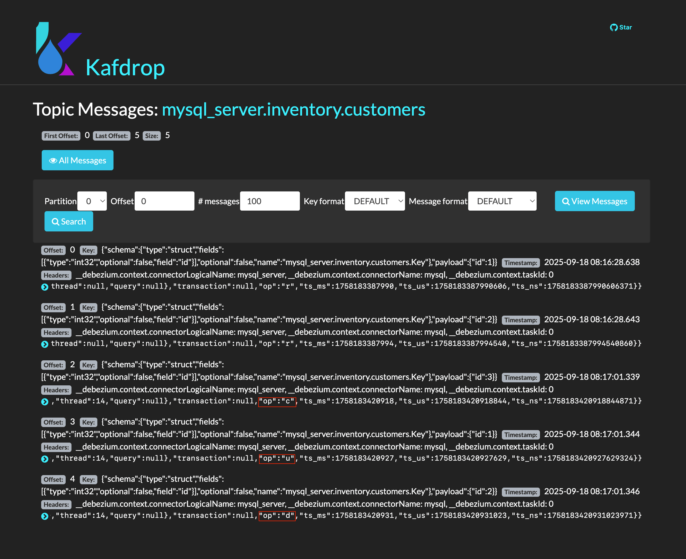

使用 Docker、KRaft 和 Kafdrop 分钟级快速实践最小化的 Debezium MySQL Kafka CDC (Change Data Capture)。

<!--more-->

---

## 搭建基础服务

1. 创建 docker-compose 文件
   
    ```bash
    mkdir debezium-amd64
    cd debezium-amd64
    ```

    ```bash
    vim docker-compose.yml
    ```

    ```yaml
    services:
      kafka:
        image: bitnami/kafka:3.7
        platform: linux/amd64
        ports:
          - "9092:9092"
        environment:
          # enable KRaft (no Zookeeper)
          - KAFKA_ENABLE_KRAFT=yes
          - KAFKA_CFG_NODE_ID=1
          - KAFKA_CFG_PROCESS_ROLES=broker,controller
          - KAFKA_CFG_LISTENERS=PLAINTEXT://:9092,CONTROLLER://:9093
          - KAFKA_CFG_ADVERTISED_LISTENERS=PLAINTEXT://kafka:9092
          - KAFKA_CFG_CONTROLLER_LISTENER_NAMES=CONTROLLER
          - KAFKA_CFG_CONTROLLER_QUORUM_VOTERS=1@kafka:9093
          - KAFKA_CFG_AUTO_CREATE_TOPICS_ENABLE=true
          - ALLOW_PLAINTEXT_LISTENER=yes

      connect:
        image: quay.io/debezium/connect:3.2
        platform: linux/amd64
        ports:
          - "8083:8083"
        environment:
          - BOOTSTRAP_SERVERS=kafka:9092
          - GROUP_ID=1
          - CONFIG_STORAGE_TOPIC=connect_configs
          - OFFSET_STORAGE_TOPIC=connect_offsets
          - STATUS_STORAGE_TOPIC=connect_statuses
          - KEY_CONVERTER=org.apache.kafka.connect.json.JsonConverter
          - VALUE_CONVERTER=org.apache.kafka.connect.json.JsonConverter
          - KEY_CONVERTER_SCHEMAS_ENABLE=false
          - VALUE_CONVERTER_SCHEMAS_ENABLE=false
        depends_on:
          - kafka

      kafdrop:
        image: obsidiandynamics/kafdrop:4.2.0
        platform: linux/amd64
        ports:
          - "9000:9000"
        environment:
          - KAFKA_BROKERCONNECT=kafka:9092
        depends_on:
          - kafka

      mysql:
        image: mysql:8.0
        platform: linux/amd64
        ports:
          - "3306:3306"
        environment:
          - MYSQL_ROOT_PASSWORD=debezium
          - MYSQL_USER=debezium
          - MYSQL_PASSWORD=dbz
          - MYSQL_DATABASE=inventory
        command: >
          --server-id=857
          --log-bin=binlog
          --binlog_format=ROW
          --binlog_row_image=FULL
          --gtid_mode=ON
          --enforce-gtid-consistency=ON
          --binlog_expire_logs_seconds=600
        volumes:
          - ./mysql-init.sql:/docker-entrypoint-initdb.d/mysql-init.sql
    ```

    ```bash
    vim mysql-init.sql
    ```

    ```sql
    -- ensure the database exists and is selected
    CREATE DATABASE IF NOT EXISTS inventory;
    USE inventory;

    -- minimal demo table (keep it simple for CDC)
    CREATE TABLE IF NOT EXISTS customers (
      id INT PRIMARY KEY AUTO_INCREMENT,
      first_name VARCHAR(50),
      last_name  VARCHAR(50),
      email      VARCHAR(100),
      created_at TIMESTAMP DEFAULT CURRENT_TIMESTAMP
    );

    -- seed data for snapshot
    INSERT INTO customers (first_name, last_name, email) VALUES
    ('Alice', 'Smith', 'alice@example.com'),
    ('Bob',   'Johnson', 'bob@example.com');
    ```

    ```bash
    vim register-mysql.json
    ```

    ```json
    {
      "name": "mysql-inventory-connector",
      "config": {
        "connector.class": "io.debezium.connector.mysql.MySqlConnector",
        "tasks.max": "1",

        "database.hostname": "mysql",
        "database.port": "3306",
        "database.user": "debezium",
        "database.password": "dbz",

        "database.server.id": "857",

        "topic.prefix": "mysql_server",
        "database.include.list": "inventory",
        "table.include.list": "inventory.customers",

        "snapshot.mode": "initial",
        "snapshot.locking.mode": "none",
        "include.schema.changes": "false",
        "tombstones.on.delete": "false",

        "schema.history.internal.kafka.bootstrap.servers": "kafka:9092",
        "schema.history.internal.kafka.topic": "schema-changes.inventory"
      }
    }
    ```

    ```bash
    ls -1
    ```

    ```plain
    docker-compose.yml
    mysql-init.sql
    register-mysql.json
    ```

2. 启动服务

    ```bash
    docker-compose up -d
    ```

    ```plain
    [+] Running 5/5
    ✔ Network debezium-amd64_default      Created
    ✔ Container debezium-amd64-mysql-1    Started
    ✔ Container debezium-amd64-kafka-1    Started
    ✔ Container debezium-amd64-kafdrop-1  Started
    ✔ Container debezium-amd64-connect-1  Started
    ```

## 配置 Debezium Source Connector

1. 授权 Source Connector 访问 MySQL

    ```bash
    docker-compose exec -T mysql mysql -uroot -pdebezium -e "
    GRANT SELECT, RELOAD, SHOW DATABASES, REPLICATION SLAVE, REPLICATION CLIENT, LOCK TABLES ON *.* TO 'debezium'@'%';
    FLUSH PRIVILEGES;"
    ```

2. 注册 Source Connector

    ```bash
    curl -s -X POST http://localhost:8083/connectors \
      -H "Content-Type: application/json" \
      -d @register-mysql.json
    ```

3. 更新 Source Connector 配置（可选）

    ```bash
    jq '.config' register-mysql.json | \
    curl -s -X PUT http://localhost:8083/connectors/mysql-inventory-connector/config \
      -H "Content-Type: application/json" \
      -d @- | jq .
    ```

4. 检查 Source Connector 状态

    ```bash
    curl -s localhost:8083/connectors/mysql-inventory-connector/status | jq .
    ```

    ```json
    {
      "name": "mysql-inventory-connector",
      "connector": {
        "state": "RUNNING",
        "worker_id": "192.168.97.5:8083"
      },
      "tasks": [
        {
          "id": 0,
          "state": "RUNNING",
          "worker_id": "192.168.97.5:8083"
        }
      ],
      "type": "source"
    }
    ```

5. 触发 CDC 事件

    `插入`/`更新`/`删除`一些数据行来查看`增`/`改`/`删`事件

    ```bash
    docker-compose exec -T mysql mysql -udebezium -pdbz -e "USE inventory;
    INSERT INTO customers (first_name,last_name,email) VALUES ('Charlie','Wang','charlie@example.com');
    UPDATE customers SET email='alice_new@example.com' WHERE first_name='Alice';
    DELETE FROM customers WHERE first_name='Bob';"
    ```

6. 在 Kafdrop 上查看主题

    访问 `http://localhost:9000`

    查看主题 `mysql_server.inventory.customers`

    查看新事件 `"op":"c"` / `"op":"u"` / `"op":"d"`

    

## 配置 Debezium Sink Connector

1. 授权 Sink Connector 访问 MySQL

    ```bash
    docker-compose exec -T mysql mysql -uroot -pdebezium -e "
    CREATE USER IF NOT EXISTS 'sink'@'%' IDENTIFIED BY 'sinkpw';
    GRANT SELECT, INSERT, UPDATE, DELETE, CREATE, ALTER ON inventory.* TO 'sink'@'%';
    FLUSH PRIVILEGES;"
    ```

    ```bash
    vim register-jdbc-sink.json
    ```

    ```json
    {
      "name": "jdbc-sink-mysql",
      "config": {
        "connector.class": "io.debezium.connector.jdbc.JdbcSinkConnector",
        "tasks.max": "1",
        "topics": "mysql_server.inventory.customers",

        "connection.url": "jdbc:mysql://mysql:3306/inventory",
        "connection.username": "sink",
        "connection.password": "sinkpw",

        "insert.mode": "upsert",
        "delete.enabled": "true",
        "primary.key.mode": "record_key",
        "primary.key.fields": "id",

        "schema.evolution": "basic",
        "collection.name.format": "customers_mirror",
        "consumer.override.auto.offset.reset": "earliest"
      }
    }
    ```

2. 注册 Sink Connector

    ```bash
    curl -s -X POST http://localhost:8083/connectors \
      -H "Content-Type: application/json" \
      -d @register-jdbc-sink.json
    ```

3. 更新 Sink Connector（可选）

    ```bash
    jq '.config' register-jdbc-sink.json | \
    curl -s -X PUT http://localhost:8083/connectors/mysql-inventory-connector/config \
      -H "Content-Type: application/json" \
      -d @- | jq .
    ```

4. 检查 Sink Connector 状态

    ```bash
    curl -s http://localhost:8083/connectors/jdbc-sink-mysql/status | jq .
    ```

    ```json
    {
      "name": "jdbc-sink-mysql",
      "connector": {
        "state": "RUNNING",
        "worker_id": "192.168.97.5:8083"
      },
      "tasks": [
        {
          "id": 0,
          "state": "RUNNING",
          "worker_id": "192.168.97.5:8083"
        }
      ],
      "type": "sink"
    }
    ```

## 验证端到端数据同步

1. 检查源表

    ```bash
    docker-compose exec -T mysql mysql -usink -psinkpw -e "SELECT * FROM inventory.customers;"
    ```

    ```plain
    id  first_name  last_name  email                  created_at
    1   Alice       Smith      alice_new@example.com  2025-09-19 01:50:16
    3   Charlie     Wang       charlie@example.com    2025-09-19 01:58:59
    ```

2. 检查镜像表

    ```bash
    docker-compose exec -T mysql mysql -usink -psinkpw -e "SELECT * FROM inventory.customers_mirror;"
    ```

    ```plain
    id  first_name  last_name  email                  created_at
    1   Alice       Smith      alice_new@example.com  2025-09-19 01:50:16
    3   Charlie     Wang       charlie@example.com    2025-09-19 01:58:59
    ```

